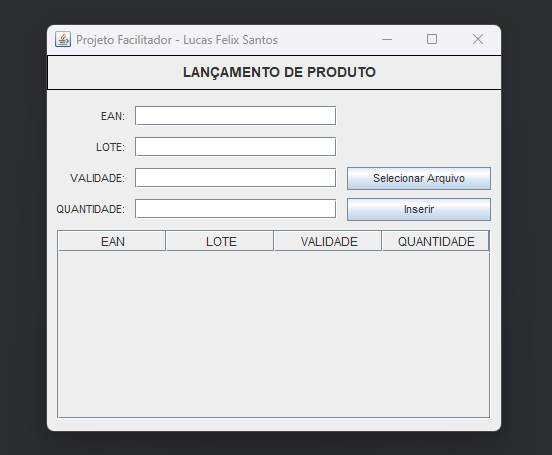
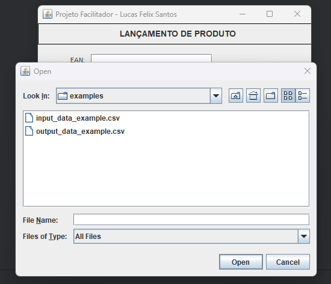
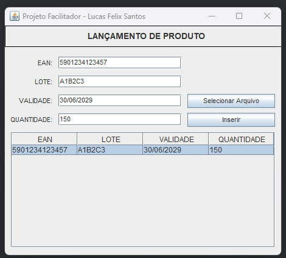

# ProjetoFacilitador

🗺️ O **ProjetoFacilitador** é um pequeno sistema desktop criado para agilizar o lançamento de produtos e apoiar processos de inventário de estoque.

A ideia é simples: o usuário informa alguns dados básicos, o sistema cruza essas informações com um arquivo `.csv` e gera um arquivo de saída já organizado, pronto para ser utilizado em exportações via Excel durante inventários de estoque.

---

## Tecnologias Utilizadas

<p align="center">
  
</p>
🔹 Java (puro) — lógica principal da aplicação  
🔹 Swing — interface gráfica desktop  
🔹 BufferedReader / BufferedWriter — leitura e escrita eficiente de arquivos `.csv`

---

## Visão Geral do Funcionamento

🔹 O usuário informa os dados básicos dos produtos  
🔹 O sistema realiza a leitura de um arquivo `.csv` de entrada  
🔹 As informações são cruzadas e processadas  
🔹 Um novo arquivo é gerado, já estruturado para uso no Excel  

O foco do projeto é reduzir retrabalho manual e minimizar erros comuns em processos de inventário.

---

## Interface do Sistema

🖥️ Tela principal da aplicação  


📄 Seleção do arquivo CSV de entrada  


🖥️ Exemplo de uso da aplicação  


📊 Arquivo final gerado para uso no Excel  


---

## Exemplos de Arquivos

🔹 O projeto conta com arquivos de exemplo para facilitar o entendimento do fluxo completo:

- **Arquivo de entrada (`input-data-example.csv`)**  
  Contém os dados base utilizados pelo sistema para o processamento.

- **Arquivo de saída (`output-data-example.csv`)**  
  Gerado automaticamente pelo sistema, já organizado para importação ou análise no Excel.

Esses arquivos servem como referência para testes e validação do funcionamento da aplicação.

---

## Como Executar o Projeto

🔹 Certifique-se de ter o **Java JDK** instalado  
🔹 Clone o repositório:
```bash
git clone https://github.com/LucasFelix-S/ProjetoFacilitador.git
